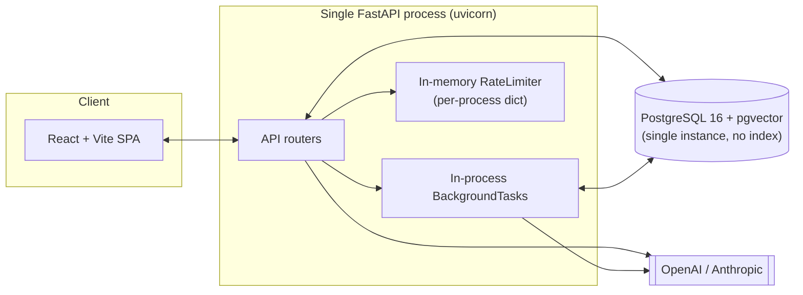

# Scalability & Optimization Report — Smart Support Ticket Router

Audit of what breaks first as this app grows past demo scale, and a
prioritized plan to fix it. This is the companion to
[token-optimization.md](token-optimization.md) (which is the deep dive on
LLM token/cost tuning, including prompt caching) — this doc covers
everything *around* the LLM calls: process architecture, data layer,
caching, and deployment. Where the two overlap (prompt caching, model
routing), this doc links out rather than repeating the detail.

Every finding below is traced to a specific file/line in the current repo,
not a generic checklist — so you can tell which items are "already true here"
vs. speculative.

## 1. How to read this doc

Each finding is tagged with **blast radius** (what breaks, and at what
scale) and **effort** (rough size of the fix). Use the [priority matrix](#8-priority-matrix)
at the end to sequence work — don't just work top-to-bottom.

## 2. Current architecture snapshot



This works well for a single dev instance or small internal deployment. Every
box above with in-memory state or no index is a wall the moment you need
**more than one backend process** — which happens as soon as you run 2+
uvicorn workers for CPU parallelism, let alone multiple container replicas
behind a load balancer.

## 3. Bottlenecks that block horizontal scaling (fix first)

These aren't optimizations — they're correctness bugs at >1 instance. Running
2 replicas today would silently produce wrong behavior, not just be "less
efficient."

### 3.1 In-memory rate limiter (`backend/app/core/rate_limit.py`)

`RateLimiter` keeps attempt counts in a per-process `dict`
(`login_rate_limiter`, `password_reset_rate_limiter`). With N replicas behind
a load balancer, each replica has its own counter — an attacker who spreads
requests across replicas effectively gets `N ×` the intended quota. The file
itself documents this trade-off honestly (see its docstring).

- **Blast radius:** brute-force protection silently weakens as you scale out.
- **Fix:** swap the dict for Redis (`INCR` + `EXPIRE`, or a sorted-set sliding
  window). Same interface (`allow(key) -> bool`), so callers in
  `app/api/auth.py` don't change — only `RateLimiter`'s internals move to a
  Redis client. This is the same Redis instance you'll want for §3.3 and
  session storage, so provision it once.
- **Effort:** small (a few hours) — the abstraction boundary is already clean.

### 3.2 In-process background routing (`app/api/customer_portal.py` → `customer_portal_service.route_created_ticket`)

Customer-submitted tickets are routed via FastAPI's `BackgroundTask`, which
runs in the same process, in-memory, with no persistence. `TECHNICAL_GUIDE.md`
§3a and §14 already call this out: a restart mid-task loses the task
entirely, and it doesn't exist across replicas — task N could be scheduled on
replica A but the customer's next poll hits replica B, which has no idea the
task is running (this actually still works today only because the *result*
is read from the DB, not from replica-local state — but the task itself has
no durability or retry).

- **Blast radius:** a routing task lost to a deploy/restart leaves a ticket
  permanently `Open` with no automatic retry (confirmed in
  `TECHNICAL_GUIDE.md` §16: "a background task that raises is logged and the
  ticket stays Open... rather than being automatically retried later").
- **Fix:** move to a real job queue — Celery or RQ (RQ is the lighter-weight
  choice given this is a single, small task type, not a complex workflow) on
  top of the same Redis instance from §3.1. `route_created_ticket(ticket_id)`
  already takes a plain ID and does its own DB session lookup — it's already
  shaped as a queue-friendly task function; the only change is *how* it gets
  invoked (`.delay(ticket_id)` instead of `background_tasks.add_task(...)`).
- **Effort:** medium — mostly infra (worker process, Redis, retry/backoff
  policy), the task logic itself barely changes.

### 3.3 Sessions are DB-backed but check per request

`app/api/deps.py::get_current_user` does a DB lookup by `token_hash` on every
authenticated request (`TECHNICAL_GUIDE.md` §9 calls this "acceptable at this
scale"). This *is* horizontally safe already (no in-memory state) — flagging
it here only because it becomes the first DB read-hotpath to watch once
traffic grows; see §5.2 (connection pool) and consider a short-TTL
Redis cache in front of it (`token_hash -> user_id`) if session lookups show
up in profiling, invalidated on logout/password-reset the same way
`user_sessions` rows already are today.

- **Blast radius:** low today; worth watching, not fixing pre-emptively.
- **Effort:** small, and only if profiling justifies it — don't do this
  speculatively.

## 4. Data layer

### 4.1 No pgvector index

`retrieval_service.py`'s `find_similar_tickets` / `find_relevant_knowledge_documents`
do a cosine-distance `ORDER BY embedding <=> :query LIMIT N` scan. Confirmed
via migration history: no `ivfflat`/`hnsw` index exists on either
`tickets.embedding` or `knowledge_documents.embedding` — every similarity
search is currently a full sequential scan with a distance computation per
row.

- **Blast radius:** fine at hundreds of rows (demo scale); becomes the
  dominant cost in `route_ticket()` once tickets/knowledge docs reach the
  thousands, since this runs synchronously on *every* routing call (both the
  sync agent path and the async customer path).
- **Fix:** add an `hnsw` index (better recall/latency tradeoff than `ivfflat`
  for pgvector ≥0.5.0) via a new Alembic migration:
  ```sql
  CREATE INDEX ON tickets USING hnsw (embedding vector_cosine_ops);
  CREATE INDEX ON knowledge_documents USING hnsw (embedding vector_cosine_ops);
  ```
  Partial index (`WHERE embedding IS NOT NULL AND status = 'Resolved'`) would
  match `find_similar_tickets`' actual filter and keep the index smaller.
- **Effort:** small (one migration) — but do it *before* it's needed, since
  building an index on a large table live is more disruptive than creating it
  early and letting it grow incrementally.

### 4.2 Connection pool is unconfigured

`db/session.py`'s `create_engine(settings.database_url, pool_pre_ping=True)`
takes SQLAlchemy's default pool (`size=5`, `max_overflow=10`). Fine for one
uvicorn worker; once you run multiple workers/replicas (needed to use more
than one CPU core — uvicorn is single-process per worker), each gets its own
pool, and `workers × 15` connections can exceed Postgres's default
`max_connections=100` well before traffic is actually high.

- **Blast radius:** connection exhaustion under concurrent load — manifests
  as intermittent `TimeoutError` acquiring a connection, worse under bursty
  traffic (e.g. many customers submitting tickets at once).
- **Fix:** explicitly size the pool (`pool_size=`, `max_overflow=`) based on
  `workers × pool_size < Postgres max_connections`, or put PgBouncer in front
  of Postgres in transaction-pooling mode once replica count grows — the
  standard fix once you have more than a couple of backend processes talking
  to one Postgres instance.
- **Effort:** small (config) now; PgBouncer is a medium infra addition later.

### 4.3 No pagination (`TECHNICAL_GUIDE.md` §16)

Customer ticket list and agent queue return unbounded result sets.

- **Blast radius:** response size and query cost grow linearly with ticket
  count — fine at demo scale (tens of tickets), a real problem once a
  workspace accumulates thousands.
- **Fix:** cursor or offset pagination on both list endpoints, with an index
  on `(status, created_at)` or similar to back the ordering. Since this is a
  breaking API change for the frontend's fetch calls, this is a good one to
  batch with a frontend release, not a silent backend change.
- **Effort:** medium (touches API contract + frontend).

## 5. Application-layer scaling

### 5.1 Stateless backend, once §3 is fixed

Once rate limiting and background tasks move off in-process state, the
FastAPI app itself is already stateless per request (sessions are DB-backed,
not server-memory) — it can run behind a standard load balancer with N
replicas with no further app changes. Worth stating explicitly: **§3 is the
actual blocker to horizontal scaling**, not the app's request-handling logic.

### 5.2 Embedding computation is synchronous, on the request path

`embedding_service.get_embedding()` (OpenAI mode) is called inline during
`route_ticket()` for the ticket being routed, and separately by
`backfill_embeddings` for historical rows. The per-request one is
unavoidable (you need the new ticket's embedding to search for similar ones)
— but it's one more synchronous external call stacked on top of the LLM call
in the same request, compounding latency (`EXPERIMENTAL_PERFORMANCE.md`
already measures avg AI routing time at 6.69s, max 14.6s — a chunk of that is
sequential: embed → search → build prompt → classify).

- **Fix (if evidence embedding + classification can overlap):** the
  embedding call and any DB reads that don't depend on it
  (`build_customer_context`) don't have a data dependency on each other —
  running them concurrently (`asyncio.gather`, or a thread pool since the
  OpenAI SDK call here is likely sync) shaves wall-clock latency without
  touching correctness. Only worth it if profiling confirms embedding call
  latency is a meaningful fraction of the 6.69s average — verify before
  investing.
- **Effort:** medium — routing_service.py's current flow is sequential by
  construction; parallelizing means restructuring `route_ticket()`'s call
  order carefully around what actually depends on what.

### 5.3 Multi-worker/multi-instance deployment checklist

Once §3's blockers are cleared, standard scale-out mechanics apply and are
worth stating as a checklist so nothing is assumed "free":

- `COOKIE_SECURE=true` and real TLS termination at the LB (`TECHNICAL_GUIDE.md`
  §14 already flags this).
- `CORS_ORIGINS` must be the real origin list, not a wildcard — already
  incompatible with `allow_credentials=True` per the existing docs, and stays
  true at any scale.
- Health checks (`GET /health`, already exists) wired into the
  LB/orchestrator so a replica that can't reach Postgres/Redis is pulled from
  rotation, not just left serving 500s.
- Structured logging with a request ID that survives across replicas (a
  correlation ID header), since `grep`-ing a single instance's logs stops
  being how you debug once there are N of them — feeds directly into §6.

## 6. Caching strategy (beyond prompt caching)

`token-optimization.md` §1 covers **LLM prompt caching** in depth (OpenAI's
automatic prefix caching already applies today at 1,122–1,377 input tokens;
explicit Anthropic `cache_control` breakpoints are scoped but not yet
justified at current traffic — see that doc's "Considered, not shipped"
section for the exact code-path it'd touch in `_call_anthropic_llm`). That
remains the single highest-leverage token-cost lever and should stay the
first thing revisited if Anthropic traffic grows or `build_prompt()`'s static
block grows further.

Beyond that one lever, three more caching layers are worth designing in as
the system scales, ordered by how much of the request they can skip
entirely:

### 6.1 Embedding cache (skip the LLM call, not just the prompt)

`embedding_service.get_embedding()` recomputes an embedding for identical or
near-identical ticket text with no memoization. A cache keyed on a hash of
the input text (Redis, TTL'd) would let repeated/duplicate ticket text (a
customer resubmitting near-identical wording, or backfill re-runs) skip an
external call entirely — strictly cheaper than prompt caching, since prompt
caching still bills the suffix, while a cache hit here bills nothing.

- **Fix:** wrap `get_embedding()` with a Redis lookup on
  `sha256(text) -> embedding_vector`, same Redis instance as §3.1/§3.2.
- **Effort:** small, purely additive (falls back to the existing behavior on
  a cache miss).

### 6.2 Context assembly cache

`build_customer_context()` re-reads customer/products/incidents from
Postgres on every routing call for the same customer. Active incidents in
particular change rarely relative to ticket volume — a short-TTL (e.g. 30–60s)
cache on `active incidents for product X` would cut redundant reads under
burst traffic (many tickets from customers on the same affected product
during an actual outage — exactly when load is highest and this data is most
static).

- **Fix:** cache at the `context_service` layer, invalidated on incident
  create/update (there's already a clear write path to hook this into,
  `app/api/incidents.py`).
- **Effort:** small; skip if reads never show up as a bottleneck in
  profiling — this is a "when it hurts" optimization, not a default.

### 6.3 HTTP-level response caching

Read-heavy, rarely-changing endpoints (e.g. `GET /api/metrics/summary`, agent
roster) are candidates for a short-TTL cache (`Cache-Control` + a Redis or
in-memory LRU) once request volume justifies it. Lower priority than 6.1/6.2
— call out here for completeness, not urgency.

## 7. Observability (needed to know *when* any of this matters)

None of the above should be built speculatively — the repo's own philosophy
(measured vs. estimated numbers, see `EXPERIMENTAL_PERFORMANCE.md`) argues
for instrumenting before optimizing further. Concretely missing today:

- **No metrics on connection pool saturation, queue depth, or cache hit
  rate** — needed to know if §4.2/§3.2/§6 are actually earning their
  complexity once built.
- **`routing_time_ms` is captured per-ticket already** (`tickets.routing_time_ms`,
  surfaced in `/api/metrics/summary`) — extend the same pattern to embedding
  call time and context-assembly time specifically, so a slow routing call
  can be attributed to a stage instead of guessed at.
- **No distributed tracing** — becomes valuable once §3.2's job queue exists,
  since a routing task's lifecycle then spans two processes (API → queue →
  worker) instead of one call stack.
- Standard app-metrics stack (Prometheus + Grafana, or a hosted equivalent)
  is the natural next step — low effort relative to the visibility it buys,
  and should land *before* §3–§6 rather than after, so each change's actual
  impact is measurable.

## 8. Priority matrix

| # | Item | Blast radius if unaddressed | Effort | Do this... |
|---|---|---|---|---|
| 3.1 | In-memory rate limiter → Redis | Security control silently weakens at >1 replica | Small | Before any multi-replica deploy |
| 3.2 | In-process background routing → job queue | Lost/stuck routing tasks on restart or with >1 replica | Medium | Before any multi-replica deploy |
| 4.1 | pgvector HNSW index | Slow routing calls as ticket/KB volume grows | Small | Now — cheap and only gets more disruptive later |
| 4.2 | Connection pool sizing | Connection exhaustion under concurrent load | Small | Before adding workers/replicas |
| 7 | Basic metrics (pool, queue, routing-stage timing) | Flying blind on whether other items help | Small–Medium | Before or alongside §3–§6, not after |
| 6.1 | Embedding cache | Redundant external calls on duplicate text | Small | Opportunistic — cheap, do alongside §3's Redis setup |
| 5.2 | Parallelize embed + context-fetch | Extra latency on every routing call | Medium | Only after profiling confirms it's worth it |
| 4.3 | Pagination | Unbounded list payloads/query cost at scale | Medium | When ticket volume outgrows a single page |
| 6.2 | Context assembly cache | Redundant reads under burst traffic | Small | When burst traffic (e.g. real outages) is observed |
| 3.3 | Session lookup cache | Extra DB read per request | Small | Only if profiling flags it |
| 6.3 | HTTP response caching | Redundant compute on read-heavy endpoints | Small | Low priority, do last |

**Read together:** items 3.1, 3.2, 4.1, 4.2, and 7 share one dependency — a
Redis instance and a job-queue worker process — so they're naturally one
infrastructure change, not five separate ones. That's the single highest-
leverage next step for this project's scalability.
