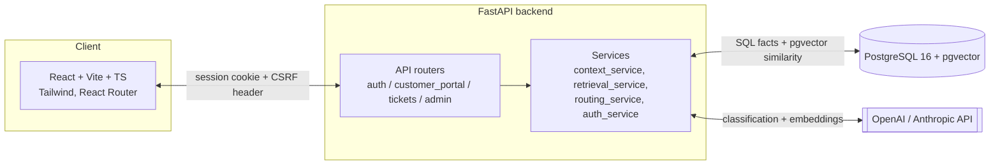
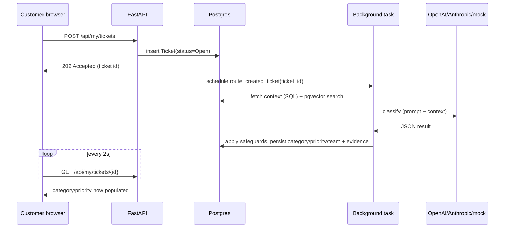
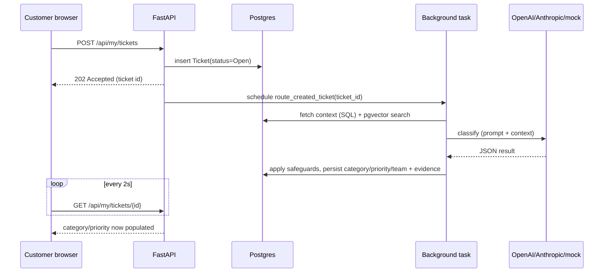
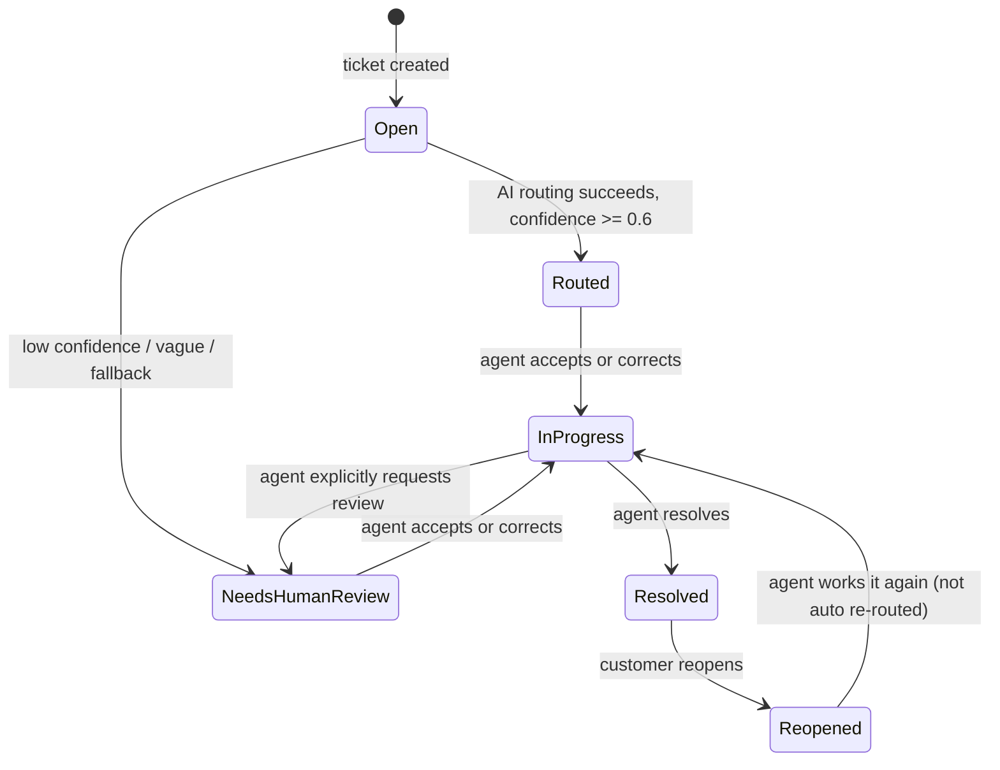

# Technical Guide — Smart Support Ticket Router

Deep-dive engineering reference. For a quick overview and setup steps, see the
main [README](../README.md). For evaluation/experiment results, see
[EXPERIMENTAL_PERFORMANCE.md](EXPERIMENTAL_PERFORMANCE.md).

## 1. System architecture



<details>
<summary>Mermaid source</summary>



</details>

Responsibilities:
- **Frontend (React/Vite/TS/Tailwind)** — auth screens, customer portal, agent workspace, admin area. No business logic beyond role-gating UI; the backend is the real authorization boundary.
- **Backend (FastAPI)** — auth/sessions, request validation (Pydantic), SQL context assembly, pgvector similarity search, LLM prompt construction and response validation, backend safety rules, persistence.
- **PostgreSQL** — source of truth for customers, products, incidents, tickets, users, sessions, audit events.
- **pgvector** — stores ticket/knowledge-document embeddings as `VECTOR` columns; similarity search uses cosine distance.
- **OpenAI / Anthropic** — optional real classification (`LLM_PROVIDER=openai|anthropic`) and real embeddings (`EMBEDDING_PROVIDER=openai`). Both default to a deterministic mock so the app runs free/offline.

## 2. Directory structure

```
backend/app/
├── api/        auth, customer_portal, tickets, admin, customers, incidents, metrics, deps.py
├── core/       config.py (settings), security.py, rate_limit.py, dev_email.py, exceptions.py
├── db/         session.py, seed.py, seed_auth.py, backfill_embeddings.py, run_demo_tickets.py
├── models/     SQLAlchemy models + enums.py (controlled vocabularies)
├── schemas/    Pydantic request/response contracts
└── services/   auth_service, context_service, retrieval_service, embedding_service,
                routing_service, ticket_service, feedback_service, conversation_service,
                admin_service, audit_service, metrics_service

frontend/src/
├── components/   TicketQueue, ConversationPanel, Customer360, AIRecommendationCard,
│                 ContextComparisonPanel, ProtectedRoute, Agent/Customer/AdminLayout, ui/
├── contexts/     AuthContext, ThemeContext
├── pages/        auth/, customer/, admin/, WorkspacePage, AnalyticsPage
├── services/     api.ts (fetch wrapper: credentials + CSRF header)
└── types/        TypeScript types mirroring backend schemas
```

## 3. Ticket lifecycle

There are **two distinct routing paths** in the codebase — worth being precise about, since they behave differently:

### 3a. Customer self-service submission (async)

`POST /api/my/tickets` (`app/api/customer_portal.py`) persists the ticket as `Open` and returns **`202 Accepted`** immediately. Classification runs afterward in a FastAPI `BackgroundTask` (`customer_portal_service.route_created_ticket`), using its own DB session (never the request-scoped one). The customer's ticket page polls `GET /api/my/tickets/{id}` every 2 seconds (`TicketConversationPage.tsx`) until `category` is populated.



<details>
<summary>Mermaid source</summary>



</details>

A background-task retry is idempotent: `route_created_ticket` skips routing if `ticket.category` is already set. Background tasks are in-process — a server restart mid-task, or a multi-instance deployment, could lose one; a persistent job queue would be needed for production durability.

### 3b. Agent-initiated routing (synchronous)

`POST /api/tickets/route` (`app/api/tickets.py`) runs the entire pipeline synchronously and returns the full result in one response. This same endpoint powers the "Route Ticket" button in the agent workspace and the **Context Comparison demo** (`ContextComparisonPanel.tsx`), which fires two concurrent calls with `use_context=false` / `use_context=true` and `persist=false` (neither writes to the ticket) to show how much the SQL+RAG context changes the decision.

### 3c. Status transitions



<details>
<summary>Mermaid source</summary>



</details>

Reopening (`customer_portal_service.reopen_my_ticket`) only changes status back to `Reopened` — it does **not** re-run AI routing; the ticket returns to the agent queue for manual handling.

## 4. Context assembly (`context_service.py`)

`build_customer_context(db, customer_id)` gathers three things via plain SQL/ORM (no fuzziness):
- **Customer profile** — direct `db.get(Customer, customer_id)`.
- **Products/access** — `CustomerProduct` rows for that customer (subscription + access status).
- **Active incidents** — `Incident` rows where `product_id` is one of the customer's products, `status` is `Active`/`Monitoring`, and either global or matching the customer's `location`.

## 5. Embedding + similarity search

`embedding_service.get_embedding(text)` branches on `EMBEDDING_PROVIDER`:
- **mock** (default) — tokenizes text, strips English stopwords, hashes each token into one of `EMBEDDING_DIM` (384) buckets via SHA-256, counts, then L2-normalizes. This is bag-of-words overlap, **not real semantic similarity** — e.g. "dashboard won't open" and "the UI is unresponsive" would not be scored as similar.
- **openai** — calls `client.embeddings.create(model=EMBEDDING_MODEL, dimensions=EMBEDDING_DIM)`. If the call raises, it falls back to the mock embedding for that request rather than failing routing.

`retrieval_service.py` then does pgvector cosine-distance search:
- `find_similar_tickets` — only `Resolved` tickets with an embedding, excludes the ticket being routed, ordered by `human_verified` first then cosine distance, limit 5.
- `find_relevant_knowledge_documents` — documents with an embedding, ordered by cosine distance, limit 3.

`python -m app.db.backfill_embeddings` computes embeddings for any ticket/knowledge-document row where `embedding IS NULL` — run once after seeding.

## 6. Classification flow (`routing_service.py`)

`build_prompt()` assembles: allowed category/priority/team enum values, a hardcoded business-rules block ("angry tone alone must not increase priority", etc.), the customer context (or "withheld" text when `use_context=false`), similar tickets, knowledge documents, the ticket message, and strict JSON-only output instructions.

Provider dispatch (`_get_raw_result_dict`):
1. `anthropic` (if `ANTHROPIC_API_KEY` set) — Claude Messages API, model from `LLM_MODEL`, `temperature=0`.
2. `openai` (if `OPENAI_API_KEY` set) — Chat Completions API, model from `OPENAI_LLM_MODEL`, `response_format={"type": "json_object"}` (guarantees syntactically valid JSON); no temperature override (some models reject it).
3. Otherwise — a deterministic keyword-based mock classifier.

### Structured schema

The internal `_LLMOutput` model (validated immediately after any provider call) requires exactly:

| Field | Type |
|---|---|
| `category` | enum `TicketCategory` |
| `priority` | enum `TicketPriority` |
| `assigned_team` | enum `AssignedTeam` |
| `reasoning` | `str` |
| `confidence` | `float`, 0.0–1.0 |
| `needs_human_review` | `bool` |
| `clarification_questions` | `list[str]` |

The public `RoutingResult` schema adds `context_used` (`customer_profile_used`, `product_ids`, `active_incident_ids`, `similar_ticket_ids`, `knowledge_document_ids`) — always computed by the backend itself, **never** trusted from the model's output.

### Retry, malformed output, and fallback

`LLM_MAX_ATTEMPTS = 2` (one attempt + one controlled retry). Any exception — malformed JSON, a Pydantic validation error, or a network/provider error — is caught and retried once. If both attempts fail, the safe fallback is used:

```
category=Other, priority=Medium, assigned_team=General Support,
confidence=0.0, needs_human_review=True,
reasoning="Automatic routing was unavailable, so this ticket was sent to
           General Support for manual triage."
```

The fallback still passes through the backend safeguards below (its `confidence=0.0` reinforces `needs_human_review=True` regardless).

## 7. Backend safety rules (`apply_backend_safeguards`)

Applied after **every** LLM/mock call, regardless of provider — these hold 100% of the time, unlike model output:

1. Message is vague (numeric-only, or a very short "broken"/"help"/"issue"-style phrase) **or** the model already said `Needs Clarification` → force `category=Needs Clarification`, `assigned_team=General Support`, `priority=Low`, `needs_human_review=True`, and fill default clarification questions if the model gave none.
2. Otherwise: `category=Security` → force `priority=High`.
3. Message mentions outage keywords → force `priority=High`.
4. Billing/account-access category **and** an active subscription with inactive/suspended product access ("payment deducted, access missing") → force `priority=High`.
5. Technical category **and** a Critical/High-severity active incident **and** current priority is Medium → bump to `priority=High`.
6. `confidence < 0.6` → force `needs_human_review=True`, independent of category (this is `CONFIDENCE_HUMAN_REVIEW_THRESHOLD` in `routing_service.py`).

### Edge cases

| Input | Behaviour |
|---|---|
| Numeric-only (e.g. "12345") | Matched as vague by regex → forced to Needs Clarification / Low / General Support / human review |
| Very short/vague ("broken", "help") | Same as above; mock classifier also scores these at low confidence (0.35) |
| Angry/emotional tone | The prompt instructs the model that tone alone must not raise priority; there is no separate keyword/sentiment detector — this relies on the LLM following instructions (the mock classifier has no anger logic at all) |
| Ambiguous (e.g. mentions both billing and access) | Routed to the closer-matching category at lower confidence, which itself triggers human review below the 0.6 threshold |
| Empty message | Rejected with `422` at the schema-validation layer (`TicketRouteRequest` validator) — never reaches routing logic |
| Very long message (> `MAX_TICKET_MESSAGE_LENGTH`, default 4000 chars) | Rejected with `422` at the same validator |
| Non-English/multilingual (e.g. Hindi) | No explicit language detection/translation. The mock embedding's stopword list and the mock keyword classifier are English-only, so a non-English message correctly falls through to low confidence rather than a fabricated confident answer. A real LLM provider understands other languages natively; a real embedding model handles them with better (but unverified in this repo) fidelity than the mock. |

## 8. Agent workflow: accept, correct, assign, reply, resolve

- **Accept/correct** (`feedback_service.record_feedback`) — writes a `RoutingFeedback` row capturing both the AI's original decision (`ai_category`/`ai_priority`/`ai_assigned_team`) and the agent's final decision, then applies the final values onto the ticket. Status becomes `In Progress` (and `needs_human_review` clears) unless the agent explicitly checks "send for human review" (→ `Needs Human Review`) or the ticket is already `Resolved`.
- **Assign** (`conversation_service.assign_ticket`) — sets `Ticket.assigned_agent_id`, inserts an append-only `TicketAssignment` audit row, and records an `AuditEvent`.
- **Reply / internal note** (`conversation_service.add_agent_message`) — `Agent Reply` messages are visible to the customer; `Internal Note` messages never are (`list_messages_for_customer` explicitly filters them out). Both are audit-logged.
- **Resolve** (`ticket_service.resolve_ticket`) — sets status `Resolved`, stores the resolution text, stamps `resolved_at`.

## 9. Authentication, sessions, CSRF, RBAC

- **Sessions, not JWTs.** `secrets.token_urlsafe(32)` generates the raw token; only its SHA-256 hash is stored in `user_sessions.token_hash`. The raw token lives in an **HttpOnly**, `SameSite=Lax` cookie (`session_token`), `Secure` when `COOKIE_SECURE=true`.
- **Sliding expiry** — every authenticated request extends `expires_at` by `SESSION_LIFETIME_HOURS` (default 12) and updates `last_seen_at`; no separate refresh endpoint.
- **CSRF (double-submit cookie)** — a second, non-HttpOnly `csrf_token` cookie is echoed back by the frontend as an `X-CSRF-Token` header on any non-GET/HEAD/OPTIONS request; `app/api/deps.py::get_current_user` rejects the request with `403` if the header is missing or doesn't match the cookie.
- **Password hashing** — Argon2 via `argon2-cffi`.
- **Reset / verification / invitation tokens** — same pattern as sessions: a random raw token is sent (logged, dev-only), only its hash is stored, each has an expiry and a one-time-use guard. Password reset also invalidates every existing session for that user.
- **Rate limiting** — an in-memory sliding-window limiter: login/forgot-password allow 10 attempts/60s per IP+email; reset-password allows 5/300s per IP+token-prefix. Per-process only — a multi-worker/multi-instance deployment needs a shared store (Redis).
- **Dev-only email** — reset/verification/invitation links are logged (`app/core/dev_email.py`, prefixed `[DEV EMAIL]`), never returned in an API response.
- **Mass-assignment protection** — request schemas only expose explicitly-writable fields (e.g. `MyProfileUpdate` has no `tier`/`customer_id`); extra keys are silently ignored by Pydantic.
- **Ownership derived server-side** — e.g. a customer's `customer_id` always comes from their session-linked `CustomerProfile`, never from the request.
- **404 vs 403** — a customer requesting another customer's ticket gets `404`, not `403`, so a ticket ID's existence is never confirmed to someone who doesn't own it.

### Role/permission matrix

| Action | Customer | Support Agent | Admin |
|---|:---:|:---:|:---:|
| Sign up (public) | ✅ | ❌ invited only | ❌ invited only |
| Create/view own tickets, reply, reopen | ✅ | — | — |
| View any ticket / routing workspace | ❌ | ✅ | ✅ |
| Route / accept / correct / assign / resolve | ❌ | ✅ | ✅ |
| Add internal note / see AI evidence | ❌ | ✅ | ✅ |
| Invite/activate/deactivate agents, change roles | ❌ | ❌ | ✅ |
| View audit log | ❌ | ❌ | ✅ |

Enforced via `require_customer` / `require_agent` / `require_admin` dependencies in `app/api/deps.py` — the frontend hides buttons a role can't use, but the backend is the actual boundary (`backend/tests/test_authorization.py`).

## 10. Database models and migrations

**17 tables** (one per SQLAlchemy model), created across two migrations:
- Initial schema: `customers`, `products`, `customer_products`, `incidents`, `knowledge_documents`, `tickets`, `routing_feedback` (plus the `pgvector` Postgres extension).
- Auth/RBAC migration: `users`, `agent_invitations`, `agent_profiles`, `audit_events`, `auth_tokens`, `customer_profiles`, `user_sessions`, `routing_evidence`, `ticket_assignments`, `ticket_messages`.
- A later migration adds `tickets.routing_time_ms`; the most recent adds the `'Reopened'` value to the `ticket_status` enum, using Postgres's requirement that `ALTER TYPE ... ADD VALUE` run in its own autocommit block outside the normal migration transaction.

Key enums (stored as Postgres `ENUM` types, string-valued): `TicketCategory`, `TicketPriority`, `AssignedTeam`, `TicketStatus` (Open/Routed/In Progress/Needs Human Review/Resolved/Reopened), `TicketChannel`, `UserRole` (Customer/Support Agent/Admin), `MessageType` (Customer Reply/Agent Reply/Internal Note), `CustomerTier`, `SubscriptionStatus`, `AccessStatus`, `IncidentSeverity`, `IncidentStatus`.

`tickets.embedding` and `knowledge_documents.embedding` are `pgvector` columns sized by `EMBEDDING_DIM` (384) — this must stay fixed once migrated, since it's a fixed-width column.

## 11. API endpoint overview

- **Public** (`app/api/auth.py`) — signup, login, logout, forgot-password, reset-password, verify-email, accept-invitation.
- **Authenticated, any role** — `GET /api/auth/me`, `POST /api/auth/change-password`.
- **Customer** (`customer_portal.py`) — profile get/update, ticket create/list/get, ticket messages, reopen.
- **Agent** (`tickets.py`, `incidents.py`, `metrics.py`, `customers.py`) — ticket queue/route/get/feedback/resolve/messages/assign/evidence, agent roster, active incidents, metrics summary, customer lookups.
- **Admin** (`admin.py`) — invite/list/activate/deactivate/update agents, audit log.

Error shape is always `{"detail": "..."}`. Status codes: `401` not authenticated, `403` wrong role or CSRF failure, `404` not found *or* not yours, `409` conflicting state (e.g. reopening a non-resolved ticket), `422` validation failure.

## 12. Environment variables (placeholders only)

| Variable | Purpose | Default |
|---|---|---|
| `DATABASE_URL` | SQLAlchemy connection string | local dev default, see `.env.example` |
| `MAX_TICKET_MESSAGE_LENGTH` | Max ticket message length | `4000` |
| `LLM_PROVIDER` | `mock` / `anthropic` / `openai` | `mock` |
| `ANTHROPIC_API_KEY` | Claude API key (only if `LLM_PROVIDER=anthropic`) | *(placeholder in `.env.example`)* |
| `LLM_MODEL` | Claude model name | `claude-sonnet-5` |
| `OPENAI_LLM_MODEL` | OpenAI model name | `gpt-5-mini` |
| `EMBEDDING_PROVIDER` | `mock` / `openai` | `mock` |
| `OPENAI_API_KEY` | Shared by `LLM_PROVIDER=openai` and `EMBEDDING_PROVIDER=openai` | *(placeholder in `.env.example`)* |
| `EMBEDDING_MODEL` | OpenAI embedding model | `text-embedding-3-small` |
| `EMBEDDING_DIM` | pgvector column width | `384` |
| `COOKIE_SECURE` | `true` in HTTPS production | `false` |
| `SESSION_LIFETIME_HOURS` | Sliding session expiry | `12` |
| `PASSWORD_RESET_TOKEN_LIFETIME_MINUTES` | Reset link validity | `30` |
| `EMAIL_VERIFICATION_TOKEN_LIFETIME_HOURS` | Verify-email link validity | `24` |
| `AGENT_INVITATION_LIFETIME_DAYS` | Agent invite link validity | `7` |

Full field list and real placeholder text: [`.env.example`](../.env.example). Never commit a real `.env`.

## 13. Testing strategy

- **Backend (Pytest)** — 96 test functions across 10 files (`backend/tests/`), covering schema validation across repeated routing calls, angry-tone/security/outage/incident priority rules, malformed-output retry-then-fallback (mock and OpenAI paths), same-input consistency, empty/too-long message validation, cross-customer isolation and role boundaries, profile mass-assignment protection, and provider-selection config. Run with `pytest tests/ -v` against the seeded dev database.
- **Frontend (Vitest + React Testing Library)** — 35 tests across 9 files, covering ticket queue/customer-360 rendering, AI recommendation display, accept/edit flows, login/signup, `ProtectedRoute` role-gating, the customer portal, and the admin invite screen.
- **E2E (Playwright)** — `critical-flow.spec.ts` (agent routes and accepts a ticket) and `auth-flow.spec.ts` (customer↔agent conversation with internal-note/evidence isolation asserted). A third spec, `zzz-visual-check.spec.ts`, captures screenshots across roles/themes for manual review — it has no assertions and is not a pass/fail test.

See [EXPERIMENTAL_PERFORMANCE.md](EXPERIMENTAL_PERFORMANCE.md) for what has actually been measured versus estimated.

## 14. Deployment considerations

- Background-task routing is in-process — not durable across restarts or multiple instances; a persistent job queue (e.g. Celery/RQ) would be needed for production.
- Rate limiting and sessions rely on in-memory/per-process state — fine for a single dev instance, not for multi-worker/multi-instance deployment without a shared store (Redis).
- No real transactional email provider is wired in — only logged dev-mode links.
- `COOKIE_SECURE` must be `true` behind HTTPS in any real deployment.
- `CORS_ORIGINS` must list the real frontend origin(s) — wildcard origins are incompatible with cookie-based auth (`allow_credentials=True`).

## 15. Security considerations

Covered in detail in section 9. Summary of explicit, documented trade-offs: in-memory rate limiting, dev-only email delivery, `COOKIE_SECURE=false` by default for local HTTP, single-origin CORS, and server-side revocable sessions (a DB lookup per request, acceptable at this scale).

## 16. Current limitations

- Mock LLM/embedding modes are keyword/lexical, not semantic (the shipped default; real API keys unlock real understanding).
- No pagination on the customer ticket list or agent queue.
- `AgentProfile.skills` field exists in the model but isn't surfaced in the UI — no skill-based routing yet.
- No 2FA, no OAuth/social login, no email-change flow.
- Background routing has no retry/backoff beyond the in-request `LLM_MAX_ATTEMPTS`; a background task that raises is logged and the ticket stays `Open` for manual triage rather than being automatically retried later.

## 17. Implemented vs. partial vs. future

**Currently implemented:** session/CSRF/RBAC auth, SQL context assembly, pgvector similarity search, OpenAI/Anthropic/mock classification with retry and fallback, backend safety rules, agent accept/correct/assign/reply/resolve workflow, audit log, admin agent management, routing-time metrics, light/dark theme.

**Partially implemented:** agent skills field (modeled, not routed on), in-memory rate limiting (functional, not distributed), dev-mode email (functional locally, not production email).

**Future ideas (not implemented; from the project's own roadmap notes):**
- Separate test database + CI pipeline.
- Secrets manager + HTTPS for production secrets handling.
- Real transactional email provider + Redis-backed rate limiter.
- Embedding/model version columns, to avoid mixing vector spaces if the embedding model changes later.
- A pgvector index and pagination for scale beyond demo-sized data.
- An offline evaluation dataset/dashboard for measured (not just spot-checked) AI quality.
- Notifications and helpdesk-tool integrations.
