# Token optimization reference

Practical techniques for reducing LLM token usage and cost, in the order
they're usually worth reaching for. Each section covers what it is, when to
use it, a concept flow diagram, and an **implementation flow** showing
exactly how it plugs into (or would plug into) this codebase. The "measured
in this repo" callouts point at where each technique is (or could be)
applied in `smart-ticket-router`'s routing pipeline
(`backend/app/services/routing_service.py`).

## 0. Architecture: where these fit in the routing pipeline

Every ticket goes through the same pipeline. The numbers below map onto the
8 techniques covered in this doc, at the pipeline stage each one touches.

```mermaid
flowchart TD
    T[Ticket arrives\nTicketRouteRequest] --> CTX[context_service /\nretrieval_service:\ncustomer, incidents,\nsimilar tickets, kb docs]
    CTX --> RAG(("③⑧ trim evidence text,\ncap output tokens"))
    RAG --> BP[build_prompt&#40;&#41;:\nstatic prefix + dynamic suffix]
    BP --> CACHE(("① prefix caching\n③ trim static block"))
    CACHE --> CFG[_resolve_llm_config&#40;&#41;:\nglobal .env or personal\nUserLLMSettings]
    CFG --> ROUTE(("④ model routing:\nsmall model for\nclassification"))
    ROUTE --> CALL["_call_openai_llm /\n_call_anthropic_llm /\n_call_groq_llm"]
    CALL --> EFFORT(("⑦ reasoning_effort /\nthinking.budget_tokens"))
    CALL --> CAP(("⑧ max_tokens /\nmax_completion_tokens cap"))
    CALL --> STREAM(("⑥ streaming\n- not used here,\nfull JSON needed"))
    CALL --> USAGE[Capture real usage:\ninput/output/total tokens]
    USAGE --> EVID[Persist on\nRoutingEvidence]

    style RAG fill:#fff3cd,stroke:#c69500
    style CACHE fill:#fff3cd,stroke:#c69500
    style ROUTE fill:#d4edda,stroke:#2e7d32
    style EFFORT fill:#d4edda,stroke:#2e7d32
    style CAP fill:#d4edda,stroke:#2e7d32
    style STREAM fill:#e2e3e5,stroke:#6c757d
```

Green = shipped in this repo today. Yellow = identified, not yet shipped
(see "Considered, not shipped" at the end). Grey = evaluated, doesn't apply
to this call shape. Technique ② (history truncation/summarization) and ⑤
(batching) don't appear on this diagram — routing is a stateless one-shot
call with no growing conversation history, and no non-interactive bulk queue
exists yet; both are "when you'd add this feature" reference material, not
things this pipeline currently needs.

## 1. Prompt caching

**What it is:** Providers cache the tokenized representation of a prompt
prefix so a repeated call with the same prefix skips re-processing it —
cached tokens are billed at a steep discount (often ~90% off) instead of full
price. OpenAI does this automatically for identical prefixes ≥1024 tokens, no
code change required. Anthropic requires explicit `cache_control` breakpoints
in the request.

**When to use it:** Any workload that sends the same long prefix (system
prompt, tool definitions, few-shot examples, RAG boilerplate) on every call,
with only a small suffix changing per request — exactly the shape of a
classification/routing prompt.

**What goes in the cached prefix vs. the dynamic suffix:** put anything
byte-identical across calls first — role/instructions, output schema,
business rules, static examples — and put anything that varies per request
(the actual ticket text, retrieved evidence ids) last. Reordering a prompt so
the static part comes first and never changes is often the only "code
change" needed.

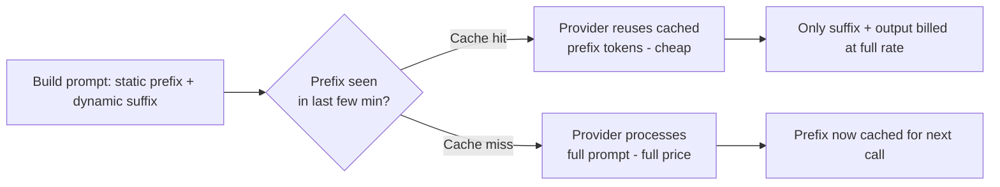

**Measured in this repo:** `build_prompt()` already puts ROLE + ALLOWED
VALUES + BUSINESS RULES + STRICT OUTPUT INSTRUCTIONS (~418 tokens) first, as
a stable block, with ticket-specific content after — this is exactly the
shape that qualifies for OpenAI's automatic prefix caching on the
larger-context scenarios (1,122–1,377 input tokens). No caching code has been
added for Anthropic yet — see "Considered, not shipped" below.

**Implementation flow if we add explicit Anthropic cache-control breakpoints:**

```mermaid
flowchart TD
    A["build_prompt&#40;&#41; in routing_service.py:\nreturn STATIC_BLOCK, dynamic_suffix\nas two separate strings instead of\none concatenated string"] --> B["_call_anthropic_llm&#40;&#41;:\nmessages=[&#123;role: user,\ncontent: [\n  &#123;type:text, text: STATIC_BLOCK,\n   cache_control: &#123;type:ephemeral&#125;&#125;,\n  &#123;type:text, text: dynamic_suffix&#125;\n]&#125;]"]
    B --> C[First call for a given\nSTATIC_BLOCK version: cache miss,\nfull price, cache written]
    C --> D[Every call in the next ~5min\nwith the same STATIC_BLOCK:\ncache hit, ~90% off input cost]
    D --> E["ROUTING_RULES_VERSION bump\nor STATIC_BLOCK edit\ninvalidates the cache naturally\n- same string = same cache key"]
```

No schema/DB change needed — this is confined to `_call_anthropic_llm` and
the shape of `build_prompt()`'s return value.

## 2. Context / history truncation and summarization

**What it is:** For multi-turn conversations, the full history re-sent every
turn grows linearly and eventually dominates the token count. Two common
mitigations: (a) truncate to the last N turns / a token budget, dropping the
oldest; (b) periodically summarize older turns into a short synopsis and
replace them with it.

**When to use it:** Any chat-style feature where the same conversation
accumulates turns (a support conversation thread, an agent-assist chat) —
not a stateless one-shot classification call like ticket routing, which has
no growing history to manage.

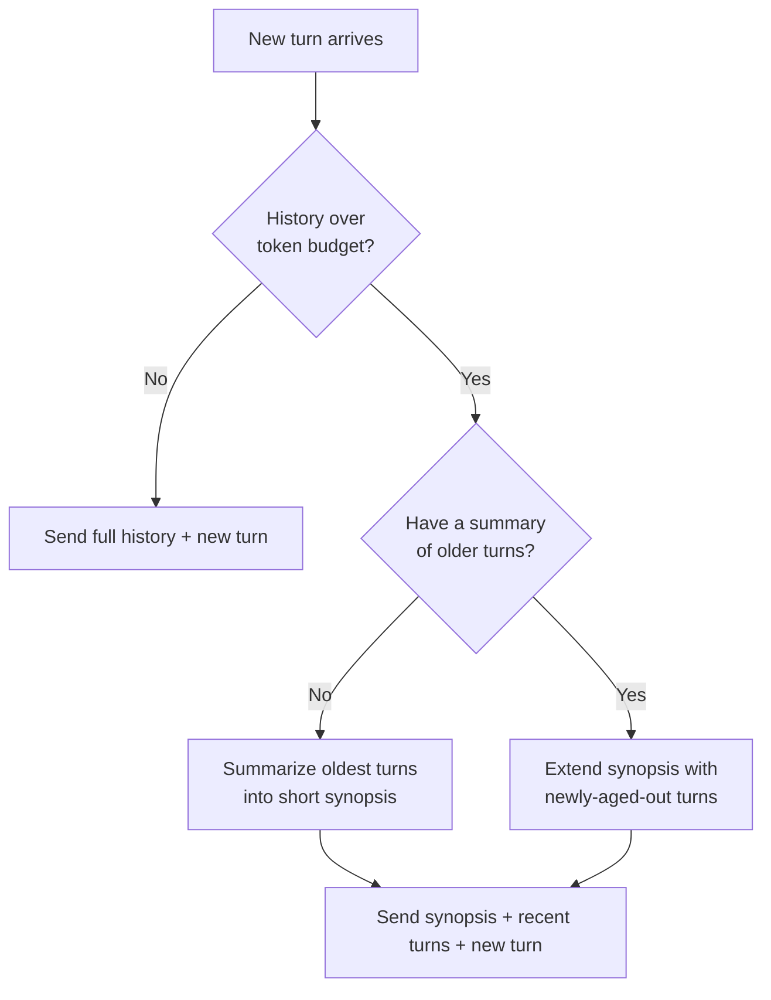

**When to reach for which:** truncation is free (no extra LLM call) and fine
when older context is genuinely disposable; summarization costs one extra
call but preserves information truncation would silently drop — use it when
early context (e.g. "customer already confirmed their account email") stays
relevant much later.

**Implementation flow if we add this here:** this repo already has a ticket
conversation thread (`TicketMessage`, `listTicketMessages`/`addTicketMessage`
in `backend/app/api/tickets.py`) — routing itself doesn't use it today, but a
future "AI-drafted reply" feature would need to feed that thread to an LLM,
and that's exactly where this applies:

```mermaid
flowchart TD
    A["New feature: draft_reply_service.py\nbuild_reply_prompt&#40;ticket_id&#41;"] --> B["Load TicketMessage rows\nfor this ticket, oldest first"]
    B --> C{"Total tokens over\na budget, e.g. 2000?"}
    C -->|No| D[Send full thread\nas-is]
    C -->|Yes| E{"conversation_summary\ncolumn already cached\non Ticket?"}
    E -->|No| F["One extra LLM call:\nsummarize messages[:-N]\ninto Ticket.conversation_summary"]
    E -->|Yes| G["Re-summarize only messages\nadded since last summary"]
    F --> H[Send summary + last N\nraw messages]
    G --> H
```

Would need one additive column (`Ticket.conversation_summary`,
`Ticket.conversation_summary_through_message_id`) via a new Alembic
migration — same additive pattern as `reasoning_effort` above.

## 3. Reducing system-prompt size / reusable structuring

**What it is:** System/instruction prompts accumulate cruft over iterations
— redundant phrasing, examples that stopped being necessary once the model
improved, verbose formatting instructions. Auditing and trimming this is pure
savings with no quality tradeoff, since it's repeated on every single call.

**When to use it:** Periodically, and whenever a system prompt is touched
for another reason — it's cheap to re-check "does every sentence here still
change the model's behavior?" Structure reusable blocks (role, output
schema, rules) as named, versioned constants so they're easy to audit and so
the same block is reused byte-for-byte across call sites (which also keeps
prompt caching effective — see §1).

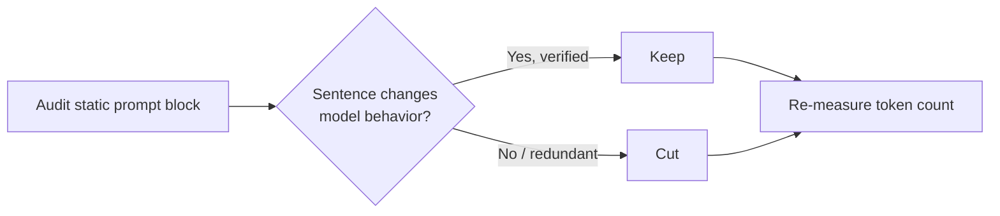

**Measured in this repo:** the static block (ROLE + ALLOWED VALUES +
BUSINESS RULES + OUTPUT INSTRUCTIONS) is ~418 tokens on every call — that's
the ceiling for what this technique can still claw back here; it's already
fairly tight, but worth re-auditing whenever `build_prompt()` changes.

**Implementation flow in this repo:**

```mermaid
flowchart LR
    A["Extract ROLE/RULES/OUTPUT\ninto named constants at the top\nof routing_service.py, e.g.\nROLE_BLOCK, OUTPUT_INSTRUCTIONS"] --> B["Bump ROUTING_RULES_VERSION\n&#40;models/routing_evidence.py&#41;\nwhenever wording changes"]
    B --> C["Re-run the tiktoken measurement\nscript against the new constants"]
    C --> D{"Token count\nwent down?"}
    D -->|Yes| E["Update the measured-tokens\ntable in this doc"]
    D -->|No, or quality regressed| F["Revert - test_routing.py's\nschema-validity tests catch\na broken output contract"]
```

## 4. Model routing (smaller models for simple sub-tasks)

**What it is:** Not every call needs the largest/most capable model. Route
cheap, well-defined sub-tasks (classification, extraction, formatting) to a
smaller/cheaper model, and reserve the frontier model for genuinely open-ended
reasoning.

**When to use it:** Whenever a pipeline has multiple distinct LLM calls with
different difficulty, or when a single task (like 6-way ticket
classification) doesn't need a large model's full capability at all.

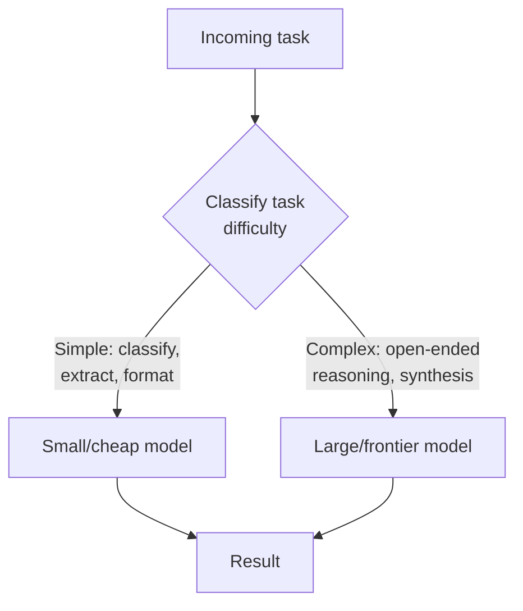

**Measured in this repo:** this is effectively what `gpt-5-mini` (the
default `OPENAI_LLM_MODEL`) already is for this app — routing/classification
doesn't need a frontier model. The per-agent LLM settings feature
(`UserLLMSettings`) extends this idea to the user level: an agent can pick a
cheaper/faster model for their own routing calls without affecting anyone
else's.

**Implementation flow in this repo** (how a routing call actually picks its
model today):

```mermaid
flowchart TD
    A["route_ticket_request&#40;&#41;\nin routing_service.py"] --> B["_resolve_llm_config&#40;db, user&#41;"]
    B --> C{"UserLLMSettings row\nexists for this agent?"}
    C -->|Yes| D["LLMConfig&#40;user_settings.provider,\ndecrypted key,\nuser_settings.model_name&#41;\n- e.g. their own gpt-5-nano"]
    C -->|No| E["_global_llm_config&#40;&#41;:\nsettings.llm_provider /\nOPENAI_LLM_MODEL from .env\n- workspace default"]
    D --> F["_call_openai_llm / _call_anthropic_llm\n/ _call_groq_llm&#40;prompt, config&#41;"]
    E --> F
```

Extending this further (e.g. auto-picking a bigger model only when
`needs_human_review` was true on a first pass) would be a second call inside
`route_ticket()` gated on the first result, reusing the same `LLMConfig`
plumbing.

## 5. Batching requests

**What it is:** Providers offer batch APIs (e.g. OpenAI's Batch API) that
process a large set of non-urgent requests asynchronously (often within 24h)
at a significant discount (typically ~50% off) compared to synchronous calls.

**When to use it:** Bulk, non-interactive workloads with no user waiting on
an immediate response — bulk re-classification of historical tickets,
nightly reports, backfills. Not applicable to interactive ticket routing,
where an agent is waiting on the result in real time.

**When it doesn't help:** anything on the interactive request path — a
support agent routing a live ticket can't wait hours for a batch window.

**Implementation flow if we add this here** (e.g. a nightly "re-classify all
stale tickets" admin job):

```mermaid
flowchart TD
    A["New: admin-triggered or\ncron job in a batch_reclassify_service.py"] --> B["Query Ticket rows matching\na filter, e.g. category IS NULL"]
    B --> C["Build one prompt per ticket\nvia the existing build_prompt&#40;&#41;"]
    C --> D["Submit all as one OpenAI\nBatch API job&#40;.jsonl of requests&#41;"]
    D --> E["Store the batch_id on a new\nBatchJob row, status=pending"]
    E --> F["Poll job status &#40;cron or\nwebhook&#41;"]
    F --> G["On completion: parse each\nresult through the same\n_get_raw_result_dict / RoutingResult\nvalidation path route_ticket&#40;&#41; uses"]
    G --> H["Persist via the existing\nRoutingEvidence write path"]
```

Reuses the same prompt-building and result-validation code as the live path
— only the request submission/polling mechanics are new.

## 6. Streaming vs. full-response tradeoffs

**What it is:** Streaming returns tokens incrementally as they're generated;
a full response waits for generation to complete before returning anything.
Streaming doesn't reduce token count or cost by itself — the tradeoff is
latency-to-first-byte and the ability to cut a response short.

**When it saves tokens:** when paired with an early-stop condition — e.g.
detecting the answer is already complete (a closing brace in JSON mode) and
cancelling the rest of a runaway generation, or letting a user interrupt a
response they've seen enough of. Streaming with no early-stop logic costs the
same tokens as a full response, just delivered progressively.

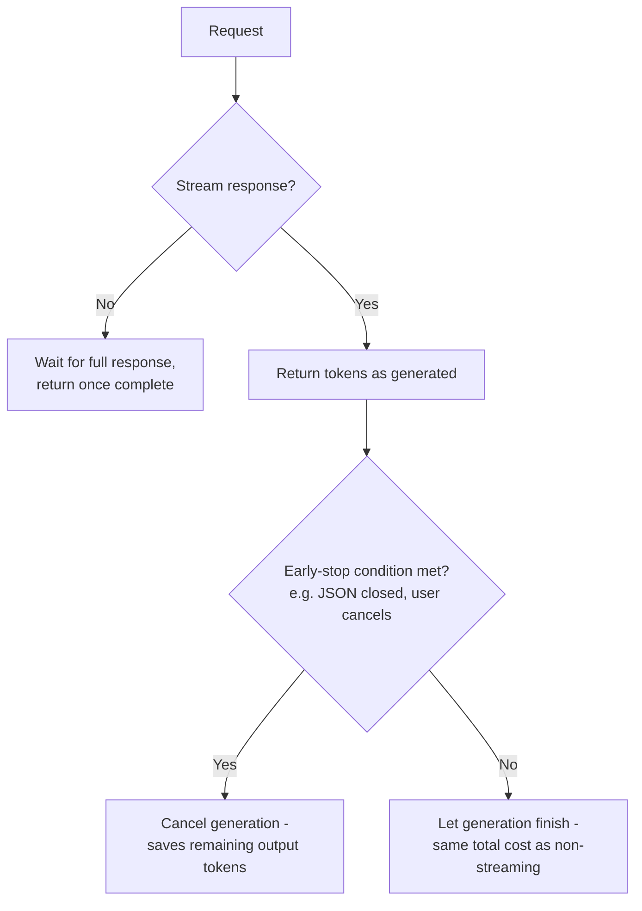

**Measured in this repo:** ticket routing calls are non-streaming
(`client.chat.completions.create` / `client.messages.create` without
`stream=True`) — appropriate here, since the full JSON result is validated
as a whole before use; there's no partial result an agent can act on early.

**Implementation flow if we ever streamed a routing call** (not
recommended for this endpoint, shown for reference): `POST
/api/tickets/route` returns one validated `TicketRouteResponse` object — a
partial stream can't be schema-validated mid-flight, so streaming would only
make sense for a *different*, free-text endpoint (like a draft-reply
feature), not this one:

```mermaid
flowchart TD
    A["New free-text endpoint, e.g.\nPOST /api/tickets/&#123;id&#125;/draft-reply"] --> B["client.chat.completions.create&#40;\n..., stream=True&#41;"]
    B --> C["FastAPI StreamingResponse\nyields chunks to the frontend\nas they arrive"]
    C --> D{"Frontend detects\nresponse looks complete\nor agent clicks Stop?"}
    D -->|Yes| E["Abort the HTTP stream -\nprovider stops billing\nfurther output tokens"]
    D -->|No| F[Stream runs to natural\ncompletion - full cost]
```

## 7. Reasoning-effort tuning

**What it is:** Reasoning models (OpenAI's `gpt-5`/`o`-series, Anthropic's
extended-thinking models) can spend a variable, sometimes very large, number
of hidden "reasoning" tokens before producing visible output — billed the
same as output tokens even though the app never sees them. Tuning this down
for tasks that don't need deep reasoning is often the single biggest lever
available, and it's free to ship (no quality tradeoff for simple tasks).

**When to use it:** Turn reasoning down (`minimal`/`low`, or a small thinking
budget) for narrow, well-defined tasks — classification, extraction,
formatting. Turn it up (`high`, or a larger thinking budget) for genuinely
open-ended or high-stakes reasoning where more deliberation measurably
improves the answer.

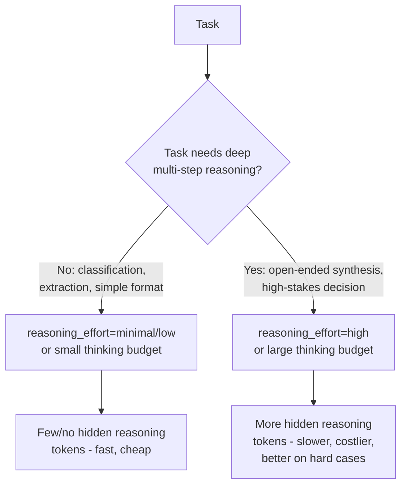

**Measured and shipped in this repo:** ticket routing is a 6-way
classification task — it doesn't benefit from deep reasoning. Real,
measured `gpt-5-mini` calls with the same prompt:

| Reasoning effort | Input tokens | Output tokens | of which hidden reasoning | Total |
|---|---|---|---|---|
| Default (no override) | 575 | 650 | 512 (79%) | 1,225 |
| `minimal` | 575 | 147 | 0 | 722 |

**−41% total tokens, −77% output tokens, no quality loss** — both produced
valid, schema-conformant JSON with a sensible reasoning sentence. This is
wired into `_call_openai_llm`/`_call_groq_llm` in `routing_service.py`
(`reasoning_effort=config.reasoning_effort or "minimal"`, falling back to a
plain call on `BadRequestError` for models that reject the parameter — e.g.
the `gpt-4o` family) and into `_call_anthropic_llm` via `thinking.budget_tokens`
for Claude models that support extended thinking. The per-agent LLM Settings
page exposes this as a "Reasoning effort" dropdown, populated per-model from
`REASONING_LEVELS_BY_PREFIX` (`backend/app/schemas/user_llm_settings.py`) —
shown only for model families known to support it, defaulting to `minimal`
for everyone else so this optimization applies workspace-wide without any
agent having to opt in.

**Implementation flow in this repo** (the actual save → call path):

```mermaid
flowchart TD
    A["LlmSettingsPage.tsx:\nagent picks a model from the\nlive-fetched dropdown"] --> B{"reasoning_levels_for_model&#40;model_id&#41;\nnon-empty for this model?"}
    B -->|Yes| C["Show Reasoning effort <select>,\nagent picks a level"]
    B -->|No| D["Hide the control -\nreasoning_effort stays null"]
    C --> E["PUT /api/me/llm-settings\nsaves UserLLMSettings.reasoning_effort"]
    D --> E
    E --> F["Next routing call:\n_resolve_llm_config reads\nreasoning_effort onto LLMConfig"]
    F --> G{"provider is\nopenai/groq or anthropic?"}
    G -->|openai/groq| H["chat.completions.create&#40;\n..., reasoning_effort=config.reasoning_effort\nor minimal&#41;"]
    G -->|anthropic| I["messages.create&#40;\n..., thinking: &#123;budget_tokens:\nANTHROPIC_THINKING_BUDGET_TOKENS[level]&#125;&#41;"]
    H --> J[Real usage captured,\nshown in AI Evidence tab]
    I --> J
```

## 8. Output length control (`max_tokens`, stop sequences)

**What it is:** An explicit cap on how many tokens a response is allowed to
generate, and/or stop sequences that end generation as soon as a marker
(e.g. a closing `}` or a delimiter) appears. Without a cap, a model can (rarely
but expensively) run on far longer than needed, or a malformed loop can
generate to the provider's max before failing.

**When to use it:** Always set a cap sized to the task's realistic maximum
output — this is a cost/latency safety net, not a quality lever. Combine
with stop sequences when the output format has a clear natural end (e.g. a
single JSON object).

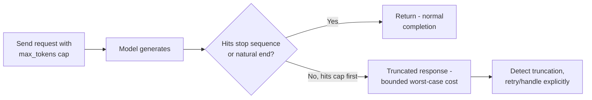

**Measured and shipped in this repo:** Anthropic calls use `max_tokens=600`
(or `budget_tokens + 600` when extended thinking is enabled, to leave room
for the actual answer after the thinking block). OpenAI/Groq calls use
`max_completion_tokens=1000` as a base — previously **uncapped**, which was
both a cost risk and a truncation risk (an unbounded response cut off
mid-JSON just triggered the app's malformed-output retry path, doubling cost
for nothing instead of failing fast).

**A sharper version of the same risk, found via live testing:** OpenAI/Groq
reasoning models spend hidden reasoning tokens out of that *same*
`max_completion_tokens` budget as the visible JSON answer. At
`reasoning_effort="high"`, a model can burn the **entire** cap on reasoning
and return a genuinely empty completion — 200/200 tokens spent, 0 visible —
which fails JSON parsing and falls back to the generic
`FALLBACK_RESULT` every time, even though nothing was actually wrong with
the key or model. Fixed by scaling the cap with the selected reasoning
level (`OPENAI_REASONING_TOKEN_HEADROOM` in `routing_service.py`: `minimal`
+0, `low` +500, `medium` +1500, `high` +4000 on top of the 1000-token base)
so there's always room left for the real answer after reasoning, mirroring
the `budget_tokens + 600` pattern Anthropic already used.

**Implementation flow in this repo:**

```mermaid
flowchart TD
    A["_call_anthropic_llm&#40;&#41;:\nreasoning_effort set?"] -->|No| B["max_tokens=600\n- plain classification,\nno thinking block"]
    A -->|Yes| C["max_tokens=budget_tokens+600\n- room for thinking\n+ the JSON answer after it"]
    D["_call_openai_llm /\n_call_groq_llm&#40;&#41;"] --> H["_openai_max_completion_tokens&#40;config&#41;:\n1000 base +\nOPENAI_REASONING_TOKEN_HEADROOM[level]"]
    H --> E["max_completion_tokens=\n1000 to 5000,\nscaled by reasoning_effort"]
    B --> F[Response parsed as JSON]
    C --> F
    E --> F
    F --> G{"json.loads succeeds\nand matches RoutingResult schema?"}
    G -->|Yes| H[Used directly]
    G -->|No, e.g. truncated| I["LLM_MAX_ATTEMPTS retry path\nin routing_service.py\n- one controlled re-ask,\nthen FALLBACK_RESULT"]
```

## Considered, not shipped (yet)

- **Explicit Anthropic `cache_control` breakpoints** — the static
  ROLE/RULES/OUTPUT block is already a stable, byte-identical prefix
  positioned to benefit, but adding explicit breakpoints is a code-path
  addition not yet justified at this app's traffic volume. OpenAI's
  automatic prefix caching already applies for free on the larger-context
  scenarios with zero code change.
- **Trimming RAG evidence text** (`_format_similar_tickets`/
  `_format_knowledge_documents` include full, untruncated message/
  resolution/content fields) — a real token saving, but also a recall/
  quality tradeoff that needs an eval, not just a token count.
- **Reducing top-k retrieval** (5 similar tickets / 3 knowledge docs) — same
  reasoning: a quality tradeoff, not a free optimization.
